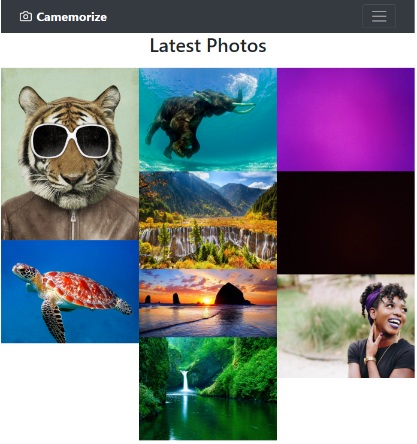

# Camemorize

#### By [Jasun Feddema](https://github.com/jaybojaybojaybo)

#### Based on the Epicodus Angular Group Project By [Ron Craig](https://github.com/r-craig73), [Alex Ficklin](https://github.com/AlexFicklin), [Jasun Feddema](https://github.com/jaybojaybojaybo), and [Johnny Mayer](https://github.com/johnnymayer)

## Description

Camemorize is an Angular application that allows users to upload multiple photos, capture an image from their webcam, and detect emotions on a single person in that photo. The website will store each photo in Firebase and display them in the image gallery. Log In credentials are required.

Hosted At [Camemorize](https://camemorize-f34d2.firebaseapp.com)

## User stories
* As a user, I would like to log into Camemorize using an email and password.
* As a user, I would like to log out of Camemorize.
* As a user, I would like to upload an image to the database.
* As a user, I would like to upload multiple images to the database.
* As a user, I would like view the image gallery.
* As a user, I would like to detect a person's primal emotion and wearing headwear (hat, hoodie, scarf, etc.).
* As a user, I would like to use the computer's webcam to upload an image to the database.


## Run through


Login using User@user.com password   



View Gallery as Login landing page   


Upload one or more pictures from the Upload page.   
Follow the link in the navbar to the Upload page.   
Choose a file from your computer.   
Push the 'Upload Images' button.   
See the pictures added to the gallery.   


Navigate to the 'Take Pic'page via the link in the navbar.   
Take a picture through your webcam and select Upload to upload it to Firebase.   
See the picture added to the gallery.   

## Setup

* Within terminal, clone this [repository](https://github.com/jaybojaybojaybo/Camemorize-Gallery) into the directory of your choice.
* Once cloned, navigate into the project folder and open with the text editor of your choice.
* Run `npm install` to install all dependencies.
* Run `ng build` to build the project. 
* Run `ng serve` for a dev server. Navigate to `http://localhost:4200/`. The app will automatically reload if you change any of the source files.

## Firebase Installation Setup
### In order to run the database, please follow the instructions below...
* In the top directory, install AngularFire and Firebase npm packages using the terminal command below:
`$ npm install angularfire2@4.0.0-rc.0 firebase@^3.6.6 --save`
* Signup and Log into Firebase (https://console.firebase.google.com/).
* Create a new project by providing a name for your project and selecting your Contry/region.
* In the "Overview" section, select 'Add Firebase to your web app'.
* Copy the initializing settings into the clipboard.
* Within the Firebase dashboard, select 'Realtime Database'.  Then select start in Test Mode.
* For Firebase credentials, create a new file called 'api-keys.ts' in the 'src/app/'' directory.
* Place your Firebase credentials and other information as shown below:
```
export let masterFirebaseConfig = {
    apiKey: "xxxx",
    authDomain: "xxxx.firebaseapp.com",
    databaseURL: "https://xxxx.firebaseio.com",
    storageBucket: "xxxx.appspot.com",
    messagingSenderId: "xxxx"
  };
```
* Also add this information to both files in the environments foler (within the src folder).
* Add the following lines in the .gitignore file..
```
#Firebase credentials
/src/app/api-keys.ts

#Environments
/environments
```

## Support and contact details

* contact the author at jasun.feddema@gmail.com

## Technologies Used

* Typescript
* Angular
* ngx webcam
* Firebase
* Google Vision API

### License

Copyright (c) 2018 Jasun Feddema
```
Permission is hereby granted, free of charge, to any person obtaining a copy of this software and associated documentation files (the "Software"), to deal in the Software without restriction, including without limitation the rights to use, copy, modify, merge, publish, distribute, sublicense, and/or sell copies of the Software, and to permit persons to whom the Software is furnished to do so, subject to the following conditions:

The above copyright notice and this permission notice shall be included in all copies or substantial portions of the Software.

THE SOFTWARE IS PROVIDED "AS IS", WITHOUT WARRANTY OF ANY KIND, EXPRESS OR IMPLIED, INCLUDING BUT NOT LIMITED TO THE WARRANTIES OF MERCHANTABILITY, FITNESS FOR A PARTICULAR PURPOSE AND NONINFRINGEMENT. IN NO EVENT SHALL THE AUTHORS OR COPYRIGHT HOLDERS BE LIABLE FOR ANY CLAIM, DAMAGES OR OTHER LIABILITY, WHETHER IN AN ACTION OF CONTRACT, TORT OR OTHERWISE, ARISING FROM, OUT OF OR IN CONNECTION WITH THE SOFTWARE OR THE USE OR OTHER DEALINGS IN THE SOFTWARE.
```